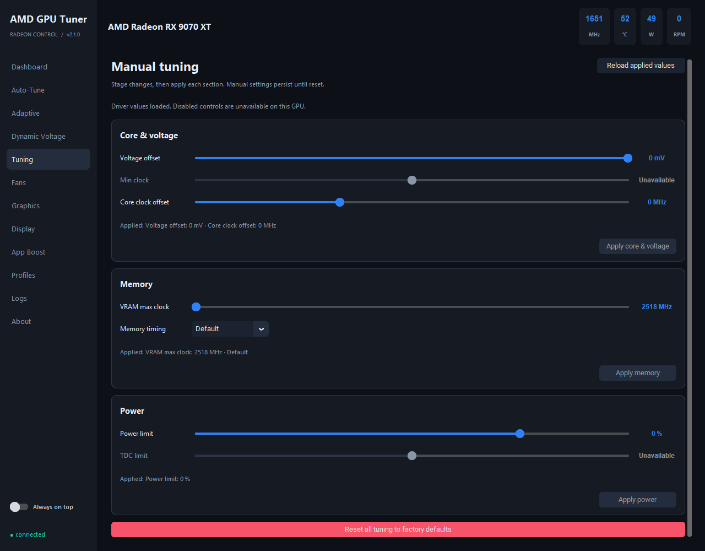

# AMD GPU Tuner

[](https://github.com/eikkapine/amd-gpu-tuner/actions/workflows/ci.yml)

**Monitor and tune an AMD Radeon GPU on Windows, with a desktop app and command line.**

AMD GPU Tuner, formerly VoltShift, combines manual tuning, live telemetry, profiles, and experimental automatic tuning through AMD's official ADLX SDK. Controls follow what the installed GPU and driver expose.

[User guide](docs/user-guide.md) · [Changelog](CHANGELOG.md) · [Report a bug](https://github.com/eikkapine/amd-gpu-tuner/issues/new/choose) · [Contribute](CONTRIBUTING.md)



Interface preview using a recorded RX 9070 XT read-only snapshot. Shown values are not tuning recommendations. [Dashboard preview](assets/amd-gpu-tuner-dashboard.png).

## What it does

| Area | Available features |
| --- | --- |
| Monitoring | Core and memory clocks, temperature, hotspot, power, fan speed, voltage and load; frame statistics when a compatible frame source is available |
| Manual tuning | GPU voltage, core clocks, VRAM clock and timing, power limits, and driver fan curves where supported |
| Profiles | Save the current driver state to JSON; apply saved settings with a per-setting result log |
| Driver settings | Supported Radeon graphics features and per-display sync, scaling and color controls |
| Dynamic Voltage | Clock thresholds select validated voltage offsets while running; requires the `MGT2_1` interface |
| Auto-Tune | Compare candidate settings with a baseline under a running workload; keep a confirmed improvement or restore the baseline |
| Adaptive | Apply learned per-game settings, with an optional budget of live tuning experiments |
| Benchmark tuning | Guide manually started 3DMark runs and compare their graphics scores |
| Diagnostics | Read-only status and JSON support reports; local telemetry, recovery journals and crash reports |

Automatic tuning is experimental. A successful write or a short trial does not establish long-term stability, and a performance improvement is not guaranteed. Read the [action and reset reference](docs/user-guide.md#what-applies-immediately) before changing settings.

## Requirements

- Windows 10 or 11, 64-bit, with an AMD Radeon GPU and an Adrenalin driver providing the ADLX runtime.
- Python 3.12 for the documented source and executable builds.
- Git, CMake 3.24+, and Visual Studio 2022 or newer Build Tools with **Desktop development with C++** to build the native bridge.
- An elevated terminal for hardware tuning and PresentMon capture. Start with the read-only commands below to inspect the installation.

Feature support depends on the GPU, VBIOS and driver. The bridge currently selects the first discrete GPU reported by ADLX, falling back to the first GPU. There is no GPU selector or simultaneous multi-GPU tuning. See [compatibility](docs/user-guide.md#compatibility-and-control-meaning).

## Install from source

Run in PowerShell:

```powershell
git clone https://github.com/eikkapine/amd-gpu-tuner.git
cd amd-gpu-tuner
py -3.12 -m venv .venv
.\.venv\Scripts\python.exe -m pip install -e ".[dev,build]"
.\scripts\build_bridge.ps1
```

The build script fetches a pinned revision of AMD's ADLX SDK on a fresh checkout and builds `bridge\build\Release\voltshift_bridge.exe`. Read the [SDK license and dependency notices](docs/THIRD_PARTY_NOTICES.md) before building or redistributing SDK-dependent binaries. The runtime DLL comes from the installed AMD driver.

Check the installation before tuning:

```powershell
.\.venv\Scripts\amd-gpu-tuner.exe status
.\.venv\Scripts\amd-gpu-tuner.exe status --json
.\.venv\Scripts\amd-gpu-tuner.exe diagnostics --output diagnostics.json
```

Launch the desktop app from an elevated terminal:

```powershell
.\.venv\Scripts\amd-gpu-tuner-gui.exe
```

`AMD-GPU-Tuner.cmd` provides a repository launcher. The old `VoltShift.cmd` launcher and `python -m voltshift` package entry point remain available for compatibility. See the [build guide](docs/user-guide.md#building-a-local-executable) for a local Windows executable build.

## Start with a baseline

1. Inspect **Dashboard** and **Tuning** to identify the selected GPU, current readings and available controls.
2. Save a profile of the current state before changing it. Saving a profile does not apply pending slider edits.
3. Use one tuning mode at a time. Keep other GPU tuning applications from applying competing changes.
4. Make a small change, apply it, then compare the same workload and inspect the result log. Check both frame pacing and temperatures.
5. Use **Reset all tuning to factory defaults** or `amd-gpu-tuner reset` to request the driver's factory tuning state.

GPU tuning can cause display resets, application crashes or system instability. If the app cannot reset tuning, use **AMD Software → Performance → Tuning → Reset**. Closing the app is not a universal reset for every driver setting.

## Command line

These commands assume the virtual environment is activated, or that its `Scripts` directory is on `PATH`:

```powershell
amd-gpu-tuner --help
amd-gpu-tuner metrics --watch
amd-gpu-tuner tune get
amd-gpu-tuner profile save "baseline"
amd-gpu-tuner autotune --goal balanced --no-download
amd-gpu-tuner adaptive --probes 0 --no-download
amd-gpu-tuner benchtune --test TimeSpy
amd-gpu-tuner reset
```

`autotune`, `adaptive`, `benchtune`, `verify`, manual setters and profile loading can write GPU settings. `adaptive --probes 0` still applies learned settings and may verify controls; it is not a read-only mode. The [user guide](docs/user-guide.md) explains each workflow and persistence behavior.

## Frame telemetry and local data

The app uses an available PresentMon executable for per-frame data, or a running RTSS installation as a fallback. When neither is available, the GUI and supported tuning sessions can fetch PresentMon from its official GitHub releases. Use `--no-download` for `autotune` and `adaptive`, or set `telemetry.auto_fetch_presentmon` to `false` in the configuration, to disable that download. Monitoring without a frame source still provides available hardware metrics; it cannot establish an FPS improvement.

Configuration, profiles, learned settings and diagnostic logs are stored locally. Existing `voltshift_*` filenames remain compatible after the rename. See [data and privacy](docs/user-guide.md#files-and-local-data) for details.

## Development

```powershell
.\.venv\Scripts\python.exe -m pytest -q
```

The Python tests exercise simulated hardware and do not validate stability on a real GPU. Native bridge compilation and read-only hardware checks complement those tests. Development details and contribution expectations are in [CONTRIBUTING.md](CONTRIBUTING.md).

## Credits and license

Original project code is MIT licensed; see [LICENSE](LICENSE). The [AMD ADLX SDK](https://github.com/GPUOpen-LibrariesAndSDKs/ADLX) is governed by AMD's SDK license agreement, with separate use and binary-distribution requirements. Dependencies retain their own terms; see [third-party notices](docs/THIRD_PARTY_NOTICES.md).

[mVolt](https://github.com/b00nz/mVolt) inspired clearer tuning workflows, status reporting and documentation. Its NVIDIA-specific controls are separate from this project's AMD implementation. The earlier manual-tuning scope was also inspired by [RadeonTuner](https://github.com/dumbie/RadeonTuner).

AMD GPU Tuner is an independent project, not affiliated with or endorsed by AMD or Intel. AMD and Radeon are trademarks of Advanced Micro Devices, Inc.
